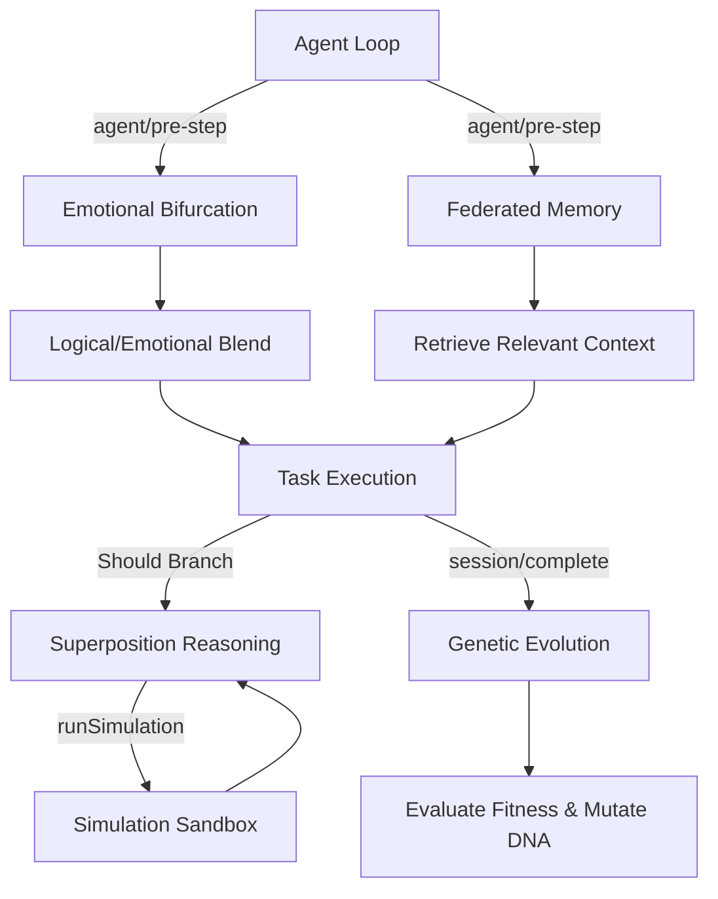

# Architecture Overview

## Plugin Relationships
- **Genetic Evolution** intercepts task outcomes to breed hyper-optimized parameters.
- **Superposition Reasoning** works heavily with the `SimulationSandbox` (from Phase 2) to score branching outcomes before committing to a reality.
- **Federated Memory** ensures differential privacy on context variables sharing across agents.
- **Emotional Bifurcation** intercepts prompt responses to balance logical execution with affective state vectors.
